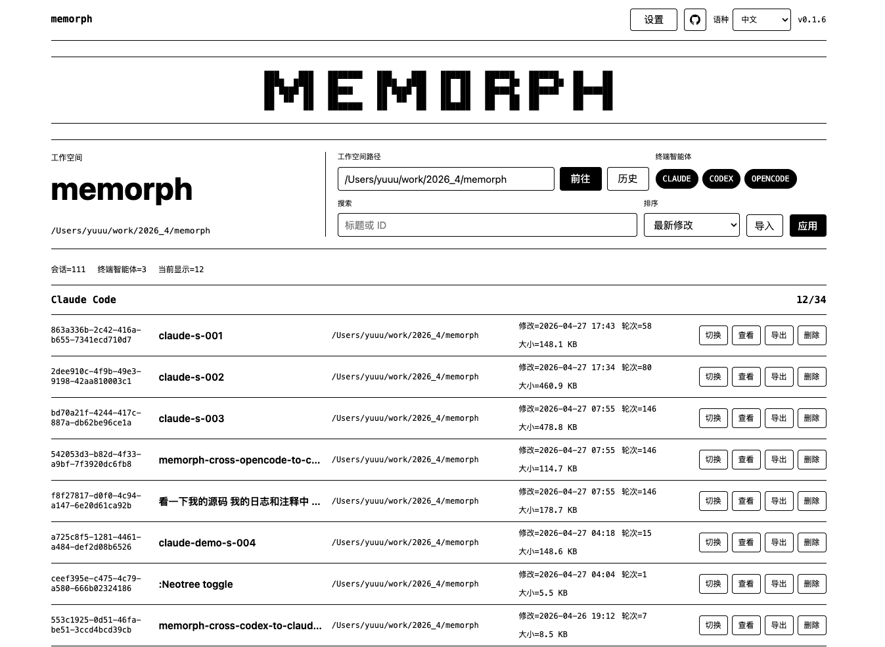
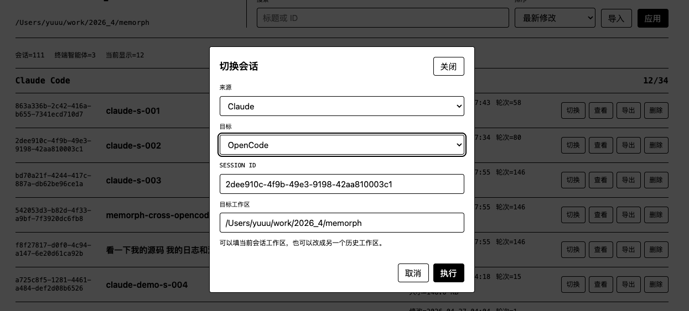
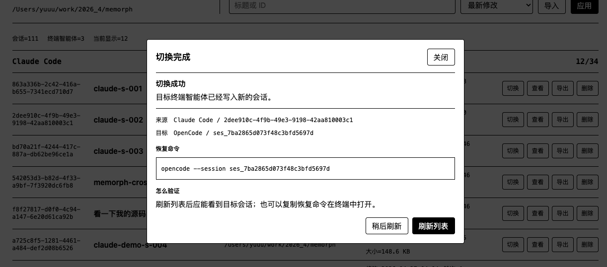
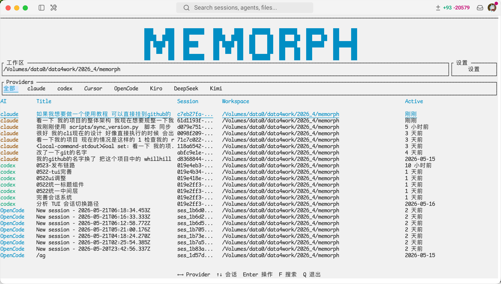
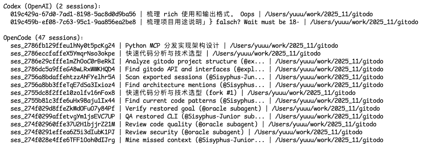
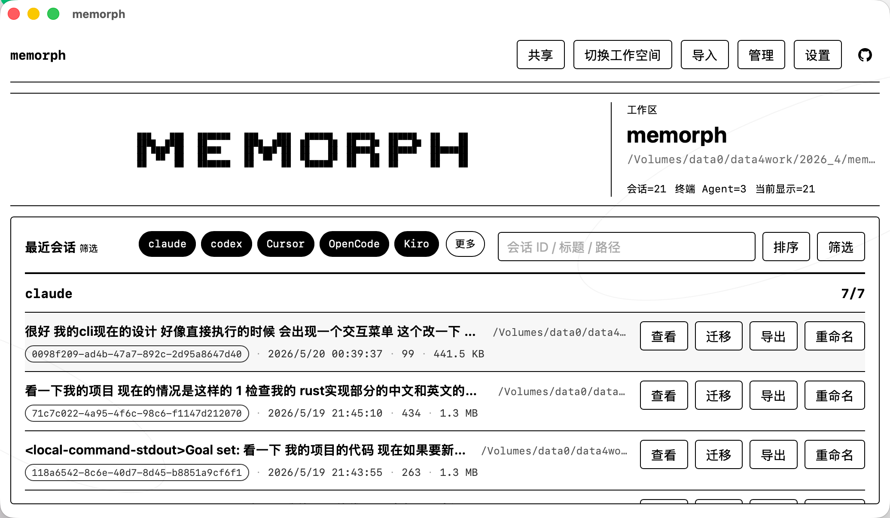

<div align="center">

<table align="center">
  <tr>
    <td>
<pre>
███   ███ ███████ ███   ███  █████  ███████ ███████ ██   ██
████ ████ ██      ████ ████ ██   ██ ██   ██ ██   ██ ██   ██
██ ███ ██ ███████ ██ ███ ██ ██   ██ ██████  ███████ ███████
██  █  ██ ██      ██  █  ██ ██   ██ ██   ██ ██      ██   ██
██     ██ ███████ ██     ██  █████  ██   ██ ██      ██   ██
</pre>
    </td>
  </tr>
</table>

---

   

[English](README_en.md) | [简体中文](README_zh.md)


</div>

> 在不同 AI 编程 Agent 之间无缝迁移会话

 

memorph 是一个会话记忆管理工具，在不同AI 编程 Agent 之间导出和切换宝贵的上下文。

---


### 快速上手

#### 安装方式

```bash
curl -fsSL https://raw.githubusercontent.com/ip2a/memorph/main/install.sh | bash
```

或通过包管理器安装：

| 包管理器 | 安装命令 | 直接运行 |
|---------|---------|---------|
| npm | `npm install -g memorph` | `memorph <命令>` |
| uv | `uv tool install memorph` | `memorph <命令>` |
| pip | `pip install memorph` | `memorph <命令>` |

完成安装之后，可以使用`memo`或者完整的命令`memorph`


---


### Web

可以直接运行：

```bash
npx memorph web
```


在这里可以看到一个简洁的web操作页面

   

在列表中选择要迁移的会话

   

点击迁移，验证目标工具中是否加载成功

   

### TUI

```bash
npx memorph
```
会自动以当前的路径为工作空间展开，确保在几步的简洁操作内就可以迁移会话

   


### CLI

CLI 可用于脚本、Agent 和人工操作。无参数运行直接打开 TUI；所有命令支持全局 `--json`。

#### 会话列表与过滤：list

```bash
memorph list [OPTIONS]
```

| 参数 | 说明 |
|------|------|
| `--all` | 显示所有工作区会话 |
| `-p, --provider <PROVIDER>` | 限定 Provider，可重复 |
| `--sort <recent/title>` | 排序方式 |
| `--limit <N>` / `--offset <N>` | 分页 |
| `-d, --dir <DIR>` | 匹配项目目录或源路径 |
| `-s, --session <PATTERN>` | 匹配会话 ID 或标题 |
| `--title <PATTERN>` | 匹配会话标题 |
| `--text <PATTERN>` | 搜索消息正文 |
| `--since <TIME>` / `--before <TIME>` | 时间过滤：日期、RFC3339、`7d`、`24h`、`30m` |
| `--min-bytes <BYTES>` / `--max-bytes <BYTES>` | 大小过滤：字节、`K`、`M`、`G` |
| `--providers` | 显示 Provider 能力矩阵 |
| `--json` | 输出 JSON，可放在命令前或命令后 |

```bash
memorph list
memorph list --all --title "登录" --since 7d
memorph --json list --text "错误" | jq .
memorph list --providers --provider codex
```

   

#### 会话迁移：switch

```bash
memorph switch <FROM> <TO> [OPTIONS]
memorph migrate <FROM> <TO> [OPTIONS]  # switch 别名
```

| 参数 | 说明 |
|------|------|
| `FROM` / `TO` | 源 Provider / 目标 Provider |
| `-s, --session-id <ID>` | 源会话 ID；省略则使用当前工作区最近会话 |
| `-t, --to-dir <DIR>` | 目标项目目录 |

```bash
memorph switch claude codex --session-id abc-123-session-id
memorph migrate claude codex --session-id abc-123-session-id
```

   

#### CLI 命令

| 命令 | 说明 |
|------|------|
| `list` | 列出并过滤会话，或显示 Provider 能力 |
| `switch` / `migrate` | 跨 Provider 迁移会话 |
| `export` | 导出会话 |
| `import` | 导入会话 |
| `remove` | 删除会话 |
| `rename` | 重命名会话 |
| `web` / `api` / `tui` | 启动 Web、API 或 TUI |
| `doctor` | 输出只读环境诊断 |
| `update` | 按安装来源更新 memorph |

#### 导入与导出

```bash
memorph export <PROVIDER> <SESSION_ID> [-o PREFIX] [-f FORMAT]
memorph import <PROVIDER> <FILE_OR_ID> [-t DIR]
```

```bash
memorph export claude abc-123-session-id -f md
memorph import claude ./backup.json --to-dir ~/projects/my-app
```

#### 删除与重命名

```bash
memorph remove <PROVIDER> <SESSION_ID>
memorph rename <PROVIDER> <SESSION_ID> <NEW_TITLE>
```

```bash
memorph remove claude abc-123-session-id
memorph rename claude abc-123-session-id "修复登录 bug"
```

### Provider 支持矩阵

memorph 支持 23 个 AI 编程 Agent 的会话管理。各 Provider 的能力存在差异：

| Provider | 导入 | 导出 | 管理/恢复 |
|---|---:|---:|---:|
| Claude | ✅ | ✅ | ✅ |
| Codex | ✅ | ✅ | ✅ |
| OpenCode | ✅ | ✅ | ✅ |
| DeepSeek | ✅ | ✅ | ✅ |
| Kimi | ✅ | ✅ | ✅ |
| Cursor | ✅ | ✅ | ✅ |
| Gemini CLI | ✅ | ❌ | ✅ |
| Kiro | ✅ | ❌ | ✅ |
| Hermes | ✅ | ❌ | ✅ |
| Cline | ✅ | ❌ | ❌ |
| Copilot | ✅ | ❌ | ❌ |
| Droid | ✅ | ❌ | ❌ |
| CodeBuddy | ✅ | ❌ | ❌ |
| Qoder | ✅ | ❌ | ❌ |
| Trae | ✅ | ❌ | ❌ |
| WorkBuddy | ✅ | ❌ | ❌ |
| Pi | ✅ | ❌ | ❌ |
| Antigravity | ✅ | ❌ | ❌ |
| OpenClaw | ✅ | ❌ | ❌ |
| Augment | ✅ | ❌ | ❌ |
| Windsurf | ✅ | ❌ | ❌ |
| Amazon Q | ✅ | ❌ | ❌ |
| Qwen | ✅ | ❌ | ❌ |

> **导出**：将 OASF canonical Session 回写为 Provider 原生格式。  
> **管理/恢复**：支持 delete / rename / resume 中至少一项。  
> 导入侧使用统一的 OASF Session 模型，导出侧的保真度取决于目标 Provider 的原生格式能力。

### OASF 兼容性

memorph 基于 [OASF (Open Agent Session Format)](https://crates.io/crates/oasf) v2（crate `oasf` 0.2.0）构建。

- 所有会话文件（`.morph`、`.json`、`.md`、`.html`）在 meta 行携带 schema name/version，导入时校验，拒绝不兼容版本
- 导入侧：23 个 Provider 的原生格式统一转换为 OASF canonical Session
- 导出侧：6 个 Provider 支持将 canonical Session 回写为原生格式（Claude、Codex、OpenCode、DeepSeek、Kimi、Cursor）
- 保真度模型：每个 Provider × Block 类型声明 `Preserved` / `Normalized` / `Downgraded` / `Dropped` / `Unsupported`，通过 `export_report` 在导出时生成损失报告

---

### 桌面端

目前已经构建了mac端的dmg版本，稳定后会逐步支持全平台的桌面端

   


---

## Star History

<div align="center">

[](https://star-history.com/#ip2a/memorph&Date)

</div>

---

