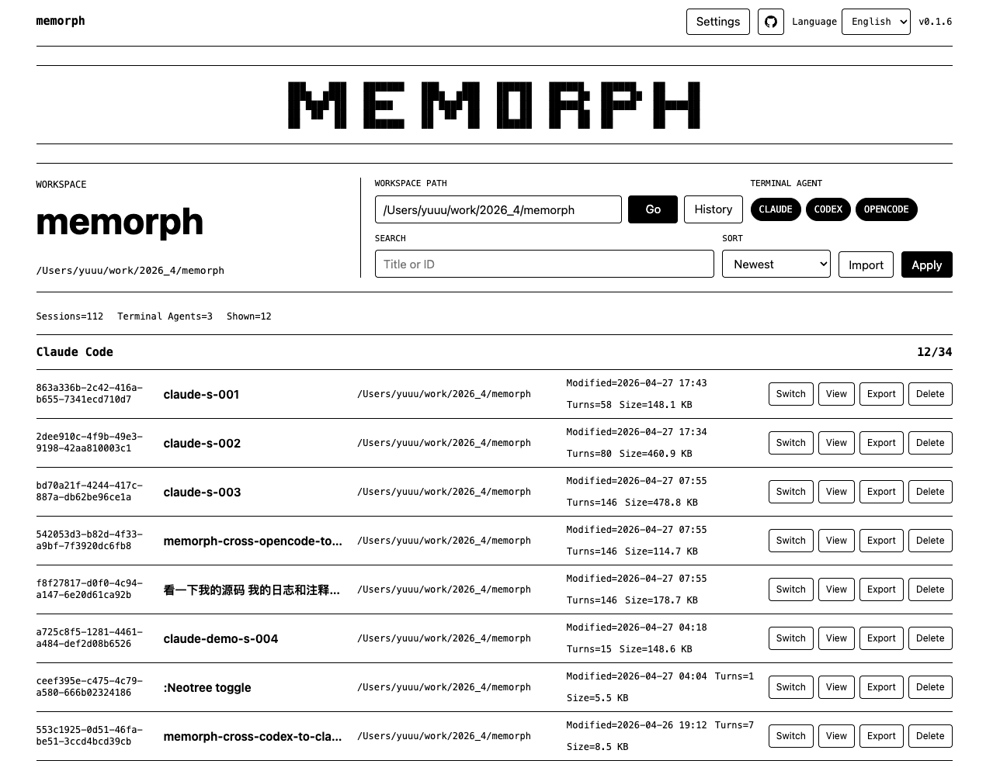
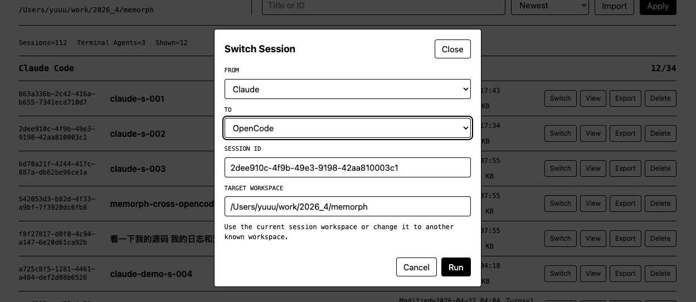
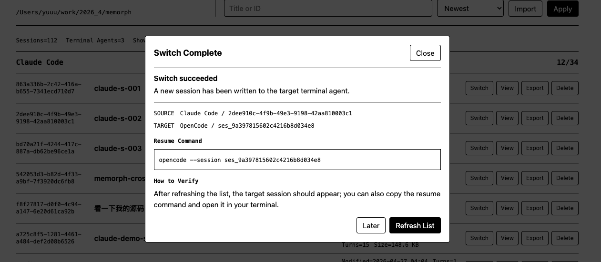

<div align="center">

<table align="center">
  <tr>
    <td>
<pre>
███   ███ ███████ ███   ███  █████  ███████ ███████ ██   ██
████ ████ ██      ████ ████ ██   ██ ██   ██ ██   ██ ██   ██
██ ███ ██ ███████ ██ ███ ██ ██   ██ ██████  ███████ ███████
██  █  ██ ██      ██  █  ██ ██   ██ ██   ██ ██      ██   ██
██     ██ ███████ ██     ██  █████  ██   ██ ██      ██   ██
</pre>
    </td>
  </tr>
</table>

---

   

[English](README.md) | [简体中文](README_ZH.md)

[Quick Start](#quick-start) | [CLI Reference](#cli-reference)

</div>

> Seamlessly migrate AI coding sessions across different agents.

### What is Memorph?

Memorph is a session migration tool that lets you freely import, export, search, and migrate AI coding sessions between **Claude Code**, **Codex** (OpenAI), and **OpenCode** — without losing context when switching tools.

---

## Installation

### npm

```bash
npm install -g memorph
```

Or run directly with npx:

```bash
npx memorph serve
```

### uv

```bash
uv tool install memorph
```

Or run directly with uvx:

```bash
uvx memorph <command>
```

### pip

```bash
pip install memorph
```

---

## Quick Start

### Web UI

```bash
memorph serve
```

Once your browser opens automatically, follow these steps:

1. Start the server

   

2. Select the session you want to migrate from the list

   

3. Click migrate and verify it loads in the target tool

   

### CLI

List available sessions in the current workspace:

```bash
$ memorph list

claude (2 sessions):
  abc-123-session-id | Fix user login issue | ~/projects/my-app
  def-456-session-id | Optimize DB queries  | ~/projects/my-app

Total: 2 sessions shown
```

Migrate a specific session to Codex:

```bash
$ memorph switch --claude2codex --session-id abc-123-session-id

Switched from Claude Code to Codex
  Source: abc-123-session-id
  Target: xyz-789-session-id
  Resume: cd ~/projects/my-app && codex
```

---

## CLI Reference

### Command Overview

| Command | Description |
|---------|-------------|
| [`list`](#list) | List sessions (current workspace only by default) |
| [`export`](#export) | Export a session to `.morph` / `.json` |
| [`import`](#import) | Import a `.morph` / `.json` file or existing session into a target tool |
| [`remove`](#remove--rename--find) | Remove a session |
| [`rename`](#remove--rename--find) | Rename a session |
| [`switch`](#switch) | Migrate a session across providers |
| [`find`](#remove--rename--find) | Search sessions by directory, title, or ID |

### Provider IDs

| Provider ID | Tool |
|-------------|------|
| `claude` | Claude Code |
| `codex` | OpenAI Codex |
| `opencode` | OpenCode |

---

### `list`

```bash
memorph list [OPTIONS]
```

| Option | Description |
|--------|-------------|
| `--all` | Show sessions across all workspaces |
| `--claude` | Show only Claude Code sessions |
| `--codex` | Show only Codex sessions |
| `--opencode` | Show only OpenCode sessions |

**Default behavior:** Without `--all`, only sessions in the current workspace are shown. Without a provider filter, all providers are queried.

```bash
# All sessions in the current project
memorph list

# Only Claude Code
memorph list --claude

# All sessions across all workspaces
memorph list --all
```

---

### `export`

```bash
memorph export <PROVIDER> <SESSION_ID> [OPTIONS]
```

| Option | Description |
|--------|-------------|
| `PROVIDER` | Source provider ID: `claude` / `codex` / `opencode` |
| `SESSION_ID` | Source session ID |
| `-o, --output <PREFIX>` | Output filename prefix, **default: `SESSION_ID`** |
| `-f, --format <FORMAT>` | `json` / `morph` / `both`, **default: `both`** |

```bash
# Default exports both (.morph + .json)
memorph export claude abc-123-session-id

# Export json only
memorph export claude abc-123-session-id -f json
```

---

### `import`

```bash
memorph import <PROVIDER> <FILE_OR_ID> [OPTIONS]
```

| Option | Description |
|--------|-------------|
| `PROVIDER` | Target provider ID: `claude` / `codex` / `opencode` |
| `FILE_OR_ID` | Path to `.morph`/`.json` file, or an existing session ID |
| `-d, --to-dir <DIR>` | Target project directory, **default: current directory** |

```bash
# Import a .morph file into Codex (current directory)
memorph import codex ./my-session.morph

# Import into a specific directory
memorph import claude ./backup.json --to-dir ~/projects/my-app

# Re-import an existing Codex session into Claude Code
memorph import claude xyz-456-session-id
```

---

### `remove` / `rename` / `find`

| Command | Syntax | Description |
|---------|--------|-------------|
| `remove` | `memorph remove <PROVIDER> <SESSION_ID>` | Remove a session |
| `rename` | `memorph rename <PROVIDER> <SESSION_ID> <NEW_TITLE>` | Rename a session |
| `find` | `memorph find [OPTIONS]` | Search sessions |

**find options:**

| Option | Description |
|--------|-------------|
| `-d, --dir <DIR>` | Fuzzy search by project directory path |
| `-s, --session <PATTERN>` | Fuzzy match by session ID or title |
| `-p, --provider <PROVIDER>` | Restrict to provider (can be used multiple times) |

**find constraint:** At least one of `--dir`, `--session`, or `--provider` is required.

```bash
# Remove
memorph remove claude abc-123-session-id

# Rename
memorph rename claude abc-123-session-id "Fix login bug"

# Search by directory
memorph find --dir ~/projects/my-app

# Search by title or ID
memorph find --session "login bug"

# Search only in Claude and Codex
memorph find --session "refactor" -p claude -p codex
```

---

### `switch`

```bash
memorph switch --<from>2<to> [OPTIONS]
```

| Option | Description |
|--------|-------------|
| `--claude2codex` | Claude → Codex |
| `--codex2claude` | Codex → Claude |
| `--claude2opencode` | Claude → OpenCode |
| `--opencode2claude` | OpenCode → Claude |
| `--codex2opencode` | Codex → OpenCode |
| `--opencode2codex` | OpenCode → Codex |
| `-s, --session-id <ID>` | Source session ID, **omitted uses the most recent session in the current workspace** |
| `-d, --to-dir <DIR>` | Target directory, **default: current directory** |

The six direction flags are mutually exclusive; only one can be used at a time.

```bash
# Latest Claude session in current directory → Codex
memorph switch --claude2codex

# Migrate a specific session
memorph switch --codex2claude --session-id xyz-456

# Migrate to a specific directory
memorph switch --claude2opencode --to-dir ~/projects/another-repo
```

---

## Star History

<div align="center">

[](https://star-history.com/#whillhill/memorph&Date)

</div>

---

Memorph is actively maintained. Feedback and suggestions are welcome.
